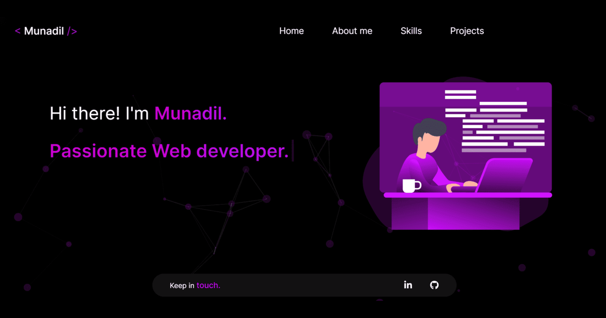

<div style="text-align: center">
  <h1>Personal portfolio</h1>
  <h2><a href="https://munadil.vercel.app" target="_blank">Live Preview</a></h2>
  
</div>

Website to showcase my skills and few projects. Built with [ReactJS](https://react.dev/), and [TailwindCSS](https://tailwindcss.com/).

## Install & run

Install dependencies with:

```bash
npm install
```

Once it's done start up a local server with:

```bash
npm run dev
```

## Permissions

Feel free to use the code or parts of it for your own site—it's open source so you can learn from it and adapt it. I encourage you to modify the theme and components to make it your own. If you're using the site's design without many changes, I'd appreciate it if you credit me as the designer.

However, you do not have permission to present any of my projects as your own. This is my portfolio and showcases real projects I've worked on.
